<p align="center">
  
</p>

<p align="center">
  
  
  
</p>

# Enterprise Network Simulation Lab

A reproducible enterprise network simulator. Synthetic office workers generate
realistic application traffic through a containerised Juniper SRX (cSRX) into a
self-contained "fake internet". Every flow carries ground-truth labels, so the
resulting telemetry is a labelled dataset for building and evaluating network
anomaly detection.

```
workers  ->  br-trust  ->  cSRX  ->  br-untrust  ->  fake internet
                            |
                          syslog  ->  telemetry  ->  dashboards + detection
```

## Why

Labelled network traffic is a real gap. The public intrusion-detection datasets
are old, full of collection artifacts, and unrealistically separable. Here the
simulator knows what every worker intended, so every flow can be labelled with
worker, persona, activity, and benign/malicious — and the same day can be
replayed with and without an attack.

## Status

| Stage | Scope | State |
|---|---|---|
| 0 | Walking skeleton — 3 workers, 1 TLS site, cSRX, flows to CSV | scaffolded |
| 1 | Telemetry spine — Vector, ClickHouse, Grafana, the labelled join | not started |
| 2 | Personas and the fake internet — 6 personas, 25 workers | not started |
| 3 | Network dashboard | not started |
| 4 | Pixel office — self-built Canvas 2D visualiser | not started |
| 5 | Adversary layer — beaconing, DNS tunnelling, exfil, scanning | not started |
| 6 | Detection — baselines, beacon finder, models, eval harness | not started |
| 7 | Response loop — alert to policy push | not started |

Full design: [`docs/architecture_and_staging_plan.md`](docs/architecture_and_staging_plan.md)
Stage 0 topology: [`docs/topology/topology.svg`](docs/topology/topology.svg)

## Requirements

- **x86_64** Ubuntu host. cSRX has no ARM build — this is a hard constraint.
- Docker Engine with Compose v2
- cSRX 26.2R1 image, with AppSecure and IDP licensed
- Python 3.8+ on the host for the verification script

The engine, adapters, personas, visualiser and detection code are all
architecture-neutral and can be developed on any machine. Only full-stack
integration needs the x86_64 host.

## Quick start

```bash
cd stage0
cp .env.example .env        # set CSRX_IMAGE to your loaded image tag
make run                    # pki -> up -> config -> traffic -> verify
```

`make verify` must pass all five exit criteria before moving to Stage 1.

## Repository layout

```
docs/           architecture and staging plan
docs/banner/    banner source + generator
docs/topology/  Stage 0 topology diagram + generator
stage0/         walking skeleton (see stage0/README.md)
```

The banner is generated, not hand-drawn — `python3 docs/banner/make_banner.py`
rebuilds it after an architecture change. A PNG is committed alongside the SVG;
swap the `img src` in this file if you prefer it.

## Note on the cSRX image

The image and licence keys are **not** in this repository and must never be
committed — they are licensed Juniper software. Load the image separately:

```bash
docker load -i <csrx-26.2R1-image>.tgz
docker images | grep csrx
```

## Development

The engine, protocol adapters, personas, visualiser and detection code are
architecture-neutral and can be developed anywhere. Only full-stack integration
against cSRX needs the x86_64 Ubuntu host.

Run outputs (`stage0/out/`) are gitignored — they are regenerated each run and
grow quickly. To compare runs across machines, export the specific `run_id`
rather than committing raw output.

## Licence

MIT — see [LICENSE](LICENSE).

### Third-party components

This repository does **not** contain, and must never contain, the Juniper cSRX
image or any Juniper licence keys. Those are licensed separately and are
excluded by `.gitignore`.

Sprite assets for the Stage 4 pixel office are not yet included. When added,
their licences will be recorded here — likely MIT assets from
[pixel-agents](https://github.com/pixel-agents-hq/pixel-agents) (which requires
retaining the copyright notice) or CC0 assets from Kenney.nl. MIT on a
repository does not automatically cover third-party art it vendors, so each
asset pack needs checking individually.
# network_simulation
