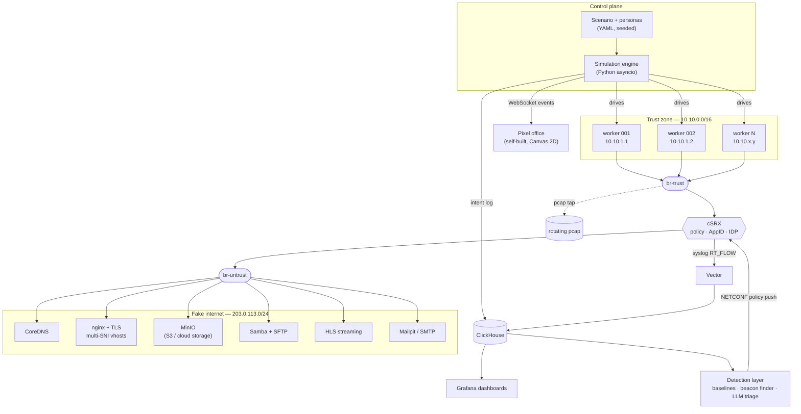

# Enterprise Network Simulation Lab — Architecture & Staging Plan

**Working name:** `network_simulation`
**Author:** Andy (with Claude)
**Date:** 12 August 2026
**Status:** Draft for review — decisions marked ⚠️ still open

---

## 1. What this is

A reproducible enterprise network simulator. Synthetic office workers generate realistic
application traffic through a containerised Juniper SRX (cSRX) into a self-contained
"fake internet." Every flow carries ground-truth labels, so the resulting telemetry is a
labelled dataset for building and evaluating network anomaly detection.

Three audiences, built in this order:

1. **Detection research testbed** — the core. Labelled data, reproducible replay.
2. **Demo piece** — the pixel office and Grafana dashboards, layered on top.
3. **Training lab** — scenario scripting and reset-to-clean, layered on top of both.

### Confirmed design decisions

| Decision | Choice |
|---|---|
| Internet model | Self-contained containerised services (no real egress) |
| Scale | Start ~10 workers, architecture must not cap growth |
| Worker intelligence | Deterministic seeded state machines, **not** LLM-driven |
| Primary telemetry | cSRX syslog `RT_FLOW` session events |
| Host | **x86_64 Ubuntu** — hard requirement, see §1.1 |

### 1.1 Host architecture is a hard constraint

cSRX requires an **x86_64 multicore CPU**. Juniper publishes no ARM build.

This is fatal rather than inconvenient on ARM because containers share the host kernel and
CPU architecture — unlike a VM, a container cannot present a different instruction set.
`--platform linux/amd64` falls back to QEMU user-mode emulation, which is tolerable for
simple userspace apps but not for a packet-forwarding dataplane. Throughput and session-rate
figures under emulation are meaningless, which defeats the purpose of a traffic lab.

Note that Containerlab's arm64 support is irrelevant here: the orchestrator's architecture
says nothing about the architecture of the node images it launches.

**cSRX is the only x86-only component.** nginx, MinIO, CoreDNS, ClickHouse, Vector,
Grafana and the Python engine all ship native arm64 images.

**Development workflow implication.** The engine, protocol adapters, personas, pixel office
and detection code can all be developed on an arm64 Mac — they're architecture-neutral.
Only full-stack integration testing needs the x86_64 Ubuntu host. Structure the repo so the
engine can run against a stub firewall target locally.

**Contingency, should the host ever change:** the `flows` schema in §5.1 is deliberately
source-agnostic. A Vector parser for Suricata EVE JSON would populate the same table
(Suricata gives app-layer protocol detection, TLS SNI/JA3, and flow byte counts on ARM),
letting the upper layers run unchanged. Not needed today — recorded as insurance only.

---

## 2. The two principles everything else follows from

### 2.1 Reproducibility is the product

A detection testbed is only useful if you can run Tuesday twice — once clean, once with
exfiltration — and diff the results. Every run is defined by a **reproducibility contract**:

```
run_id = hash(scenario_file, seed, container_image_digests, sim_engine_version)
```

Same contract in, byte-comparable flow sequence out (modulo timing jitter, which is itself
seeded). This is why workers are seeded state machines rather than LLM agents: an LLM
deciding "now Alice checks email" is slow, expensive, and destroys replay.

**Where the LLM belongs instead:** authoring personas offline, triaging alerts, and
natural-language querying of the flow database. Never in the packet path.

### 2.2 Labels are the moat

The reason to simulate rather than capture real traffic is *perfect ground truth*. The
simulator knows what every worker intended. Capture that intent as a first-class output
from Stage 1 — retrofitting it later is painful and the labels end up unreliable.

---

## 3. Architecture



### 3.1 Layers

**L1 — Persona & scenario (declarative).** YAML. A *persona* describes a role's behaviour:
activity mix, time-of-day curve, application affinities, typical object sizes. A *scenario*
is a roster of workers bound to personas, a timeline, and a seed.

**L2 — Simulation engine (Python asyncio).** Each worker is a coroutine running a weighted
state machine. Ticks are driven by a seeded RNG. Two outputs per activity: real network I/O
bound to the worker's source IP, and an intent record.

**L3 — Network fabric.** Linux bridges either side of cSRX. Trust `10.10.0.0/16`,
untrust `203.0.113.0/24` (TEST-NET-3 — unroutable by design, so a misconfiguration can
never leak to the real internet).

**L4 — Fake internet.** Containerised services with a private CA the workers trust, and
CoreDNS giving them plausible names so SNI and DNS logs look realistic.

**L5 — Telemetry.** cSRX syslog → Vector → ClickHouse. Independent pcap tap on the trust
bridge as an oracle. Intent log → ClickHouse.

**L6 — Presentation.** Grafana for the network view; a self-built Canvas 2D pixel office
for the worker view, fed directly by the engine over WebSocket.

**L7 — Adversary.** Attack personas running through the *same* engine, so detection can't
cheat by noticing malicious traffic arrives via a different code path.

**L8 — Detection & response.** Offline feature extraction and model training; online
scoring; optional NETCONF policy push back to cSRX.

---

## 4. The scaling decisions to make now

You said start small, design for large. These four choices are what make that true — each
is cheap now and expensive to retrofit.

### 4.1 A worker is not a container

The obvious approach — one container per worker, each with a headless browser — costs
300MB–1GB of RAM each and caps you around 20 workers on a normal box.

Instead: **a worker is a coroutine plus a source IP.** Workers live inside one (later N)
"workstation" containers. Each worker's traffic is bound to its own source address using
`httpx` with a configured local address, or a network namespace where a protocol library
won't cooperate.

Scaling path, with no rewrite at any step:

| Workers | Mechanism |
|---|---|
| 1–50 | Single workstation container, multiple IPs bound to one veth |
| 50–500 | Shard across N workstation containers, IP range per shard |
| 500+ | Multiple hosts, engine coordinates over the control plane |

### 4.2 Source IPs are deterministic and stable

```
ip = 10.10.(worker_id // 254 + 1).(worker_id % 254 + 1)
```

Stable across runs, so flow logs from different runs are directly comparable, and the
5-tuple join to the intent log is unambiguous.

### 4.3 Protocol adapters sit behind an interface

```python
class ProtocolAdapter(Protocol):
    name: str                       # "https", "s3", "smb", "hls", "dns"
    async def execute(self, worker: Worker, action: Action) -> IntentRecord: ...
```

Adding a protocol never touches the scheduler. This is what lets Stage 3 add four
services without destabilising Stage 1's engine.

### 4.4 Every record carries `run_id` and schema version

Non-negotiable from the first line of code. Without it you cannot compare runs, and a
detection testbed that can't compare runs is a traffic generator.

---

## 5. Telemetry schemas

### 5.1 cSRX session flows

`RT_FLOW_SESSION_CLOSE` is the backbone — it carries the full 5-tuple, byte and packet
counts in both directions, duration, the AppID classification, and the matched policy.
That is precisely the dashboard and feature-extraction feed.

```sql
CREATE TABLE flows (
    run_id          String,
    ts              DateTime64(3),
    event_type      LowCardinality(String),   -- session_create | session_close | idp
    src_ip          IPv4,
    src_port        UInt16,
    dst_ip          IPv4,
    dst_port        UInt16,
    protocol        LowCardinality(String),
    application     LowCardinality(String),   -- cSRX AppID
    nested_app      LowCardinality(String),
    policy_name     LowCardinality(String),
    src_zone        LowCardinality(String),
    dst_zone        LowCardinality(String),
    nat_src_ip      IPv4,                     -- post-NAT, if source NAT is enabled
    nat_src_port    UInt16,
    bytes_in        UInt64,
    bytes_out       UInt64,
    packets_in      UInt64,
    packets_out     UInt64,
    duration_ms     UInt32,
    session_id      UInt64,
    reason          LowCardinality(String)
) ENGINE = MergeTree
ORDER BY (run_id, src_ip, ts);
```

### 5.2 Intent log — the labelled ground truth

```sql
CREATE TABLE intents (
    run_id          String,
    schema_version  UInt8,
    ts              DateTime64(3),
    worker_id       UInt32,
    worker_name     String,
    persona         LowCardinality(String),   -- exec | developer | sales | ...
    src_ip          IPv4,
    src_port        UInt16,                   -- captured after socket bind
    dst_host        String,                   -- pre-DNS name, for SNI correlation
    dst_ip          IPv4,
    dst_port        UInt16,
    activity        LowCardinality(String),   -- browse_news | upload_report | ...
    protocol_adapter LowCardinality(String),
    label           LowCardinality(String),   -- benign | malicious
    attack_family   LowCardinality(String),   -- '' | beacon | dns_tunnel | exfil | ...
    bytes_intended  UInt64,
    duration_ms     UInt32
) ENGINE = MergeTree
ORDER BY (run_id, src_ip, ts);
```

### 5.3 The join that produces the training set

The source port is the reliable join key — the engine records it immediately after socket
bind, and cSRX logs it on both session create and session close. The time window absorbs
clock skew between the engine and the firewall.

**Watch the NAT trap.** If cSRX applies source NAT toward the untrust zone, `RT_FLOW`
carries both the original and the translated tuple. Join on the *original* source port,
which is what the engine saw. Getting this backwards silently drops the join rate to near
zero, and the symptom looks like clock skew — hence the `nat_*` columns above, so you can
tell the two failure modes apart.

```sql
CREATE VIEW labelled_flows AS
SELECT
    f.*,
    i.worker_id, i.persona, i.activity, i.label, i.attack_family, i.dst_host
FROM flows AS f
LEFT JOIN intents AS i
  ON  f.run_id   = i.run_id
  AND f.src_ip   = i.src_ip
  AND f.src_port = i.src_port
  AND abs(dateDiff('millisecond', f.ts, i.ts)) < 5000
WHERE f.event_type = 'session_close';
```

**Validate the join rate in Stage 2.** If under ~98% of flows match an intent, something
is wrong — NAT rewriting source ports, clock drift, or port reuse inside the window — and
every downstream model inherits the problem. Treat join rate as a health metric on the
Grafana dashboard, not a one-off check.

---

## 6. Build stages

Each stage has an exit criterion. Don't start the next one until it's met.

### Stage 1 — Walking skeleton
*Goal: prove the whole path end to end at minimum width.*

- `docker compose` with: one workstation container (3 workers), one nginx TLS site, cSRX, syslog to a flat file
- Deterministic source IPs, one persona, trivial browse loop
- Intent log written as JSONL

**Exit:** cSRX logs sessions from three distinct source IPs, AppID classifies them as
HTTPS/SSL, and each session matches an intent record. Dump it to CSV and eyeball it.

> **MET.** 43 sessions / 43 intents, 100% join, 100% source-port capture,
> AppID reporting `SSL`. See "Stage 1 results" in the root README for the five
> defects fixed along the way — all of them silent-corruption class.

> The most common failure here is cSRX interface/zone binding. Get one flow through
> before adding anything else.

#### Tooling decision: Docker Compose, not Containerlab

Containerlab was evaluated and rejected **for the cSRX case**. It has no cSRX kind —
Juniper's SRX appears only as `juniper_vsrx` (VM packaging). cSRX would therefore be a
generic `linux` node, giving us declarative veth wiring but none of the vendor bootstrap
knowledge that justifies a kind. Against that:

- Our topology is one firewall and two segments — no routing protocols, no multi-hop. Containerlab's value scales with topology complexity, and ours has almost none.
- The bulk of the stack (services + telemetry) is a multi-service application stack, which is Compose's strength: `depends_on`, healthchecks, volumes, env files, restart policies.

⚠️ **This reverses if we use vSRX instead of cSRX.** `juniper_vsrx` is a real kind that
handles KVM/qemu packaging and Junos config injection. In that case go hybrid: Containerlab
owns the firewall node, Compose owns services and telemetry, joined at shared Linux bridges
via Containerlab's `bridge` kind. Note known rough edges when pointing it at an existing
Docker network rather than a plain bridge.

#### Gotcha: deterministic interface ordering

cSRX expects `eth0` as management and subsequent interfaces as revenue ports, and Docker's
network attachment order sets that mapping. Set the `priority` field explicitly on each
Compose network attachment rather than relying on declaration order. Getting this wrong
produces the classic "traffic doesn't pass but the logs look fine" failure.

### Stage 2 — Telemetry spine
*Goal: observability, so you can debug everything after this.*

- Vector parsing `RT_FLOW` syslog into ClickHouse
- `flows`, `intents`, `labelled_flows` per §5
- Three Grafana panels: sessions/min, bytes by application, join-rate health
- Rotating pcap tap on the trust bridge

**Exit:** join rate ≥ 98% sustained over a 30-minute run.

**Why this comes before personas:** you cannot tell whether a persona is behaving
correctly without seeing its traffic. Building breadth first means debugging blind.

### Stage 3 — Personas and the fake internet
*Goal: traffic that looks like an office.*

- 6 personas: exec, developer, sales, support, finance, marketing
- Time-of-day curves, lunch dip, meeting blocks, a couple of night-owls
- Services: MinIO (cloud storage), Nextcloud (SaaS-ish), HLS streaming, Samba/SFTP, Mailpit, CoreDNS with ~50 plausible names
- Scale to 25 workers

**Exit:** a 24-hour compressed run produces a plausible application mix, and the daily
bandwidth curve has recognisable morning ramp, lunch dip, and evening decay.

### Stage 4 — Network dashboard
*Goal: the artefact you show people.*

- Application traffic mix over time, bandwidth, concurrent sessions, top talkers
- Per-persona traffic fingerprint (this becomes the detection baseline later)
- Run comparison view — two `run_id`s side by side

**Exit:** you can answer "what changed between run A and run B" without writing SQL.

### Stage 5 — Pixel office

**Decision: build this ourselves. Do not fork pixel-agents.**

pixel-agents visualises *Claude Code coding agents* — its event model is agent starts,
edits a file, awaits permission. Ours is workers doing network activities. The mismatch
bites hardest exactly where this project gets interesting: we need per-worker state with
no analogue in their schema (current destination, live bandwidth, benign/malicious, alert
state, blocked-by-policy). Stage 8's "worker turns red when the firewall cuts them off"
has no slot in their model. Forking also means learning their provider/adapter/transport
packages and VS Code extension packaging before changing anything — more work than writing
it.

**Take the art, not the code.** The repo is MIT, so sprite assets can be lifted with the
copyright notice retained. ⚠️ Check whether `assets/` vendors third-party packs under
their own licences — MIT on the repo does not automatically cover bundled art. CC0
alternatives: Kenney.nl, LimeZu Modern Interiors.

**Scope — deliberately small:**

- Single self-contained HTML file. Canvas 2D, no React, no bundler, no build step.
- Sprite sheet renderer with animation frames (~200–300 lines)
- Movement via **precomputed waypoint paths**, not A* — the office layout is fixed, so
  desk→meeting-room and desk→cabinet are lookup tables
- Tilemap layout as JSON, hand-authored
- WebSocket client consuming the engine's worker-state stream

Performance is a non-issue: 25 characters is trivial on Canvas 2D, and sprite batching
holds up past 500.

**Activity → animation mapping:**

| Worker state | Animation |
|---|---|
| browsing | typing at desk |
| file upload / download | walking to the cabinet |
| streaming | leaning back at desk |
| meeting | walking to the meeting room |
| idle / lunch | away from desk |
| anomaly detected | character turns red |
| blocked by policy | character greys out, traffic line cut |

**Architectural bonus:** owning the visualiser means the engine emits worker state directly
over WebSocket in whatever shape suits us. No `HookProvider` abstraction, no adapter layer
— one less thing in the design.

**Exit:** 25 characters animate in sync with live traffic, with under ~2s lag.

### Stage 6 — Adversary layer

Attack personas through the same engine. Start with the four that are genuinely visible in
firewall flow logs:

| Attack | Flow-level signature |
|---|---|
| C2 beaconing (jittered) | Regular inter-arrival times, small symmetric payloads |
| DNS tunnelling | High query volume, long labels, high entropy subdomains |
| Data exfiltration | Volumetric asymmetry — `bytes_out` ≫ `bytes_in` |
| Internal scanning | Many short sessions, many distinct destinations, high reject rate |

Then: crypto mining (persistent Stratum sessions), credential stuffing, and a **malicious
insider persona** — which fits your worker model unusually well, because it's a normal
persona with a twist rather than a separate machine.

**Exit:** a scenario timeline can inject an attack at T+3h into an otherwise identical run,
and `labelled_flows` correctly marks it.

### Stage 7 — Detection

Build in this order — each step is a fair baseline for the next:

1. **Robust statistical baselines.** Per-persona, per-hour z-scores on bytes, session count, distinct destinations. Boring, and it catches exfil and scanning.
2. **Beacon detection.** Autocorrelation or FFT over inter-arrival times per `(src_ip, dst_ip, dst_port)`. Classic, effective, and explainable.
3. **Unsupervised.** Isolation Forest over the per-worker-hour feature matrix.
4. **Supervised.** Now that you have labels, gradient boosting over flow features. Compare honestly against step 1 — often the margin is smaller than expected.
5. **LLM layer.** Alert triage and explanation, plus natural-language → SQL over ClickHouse. This is where an LLM genuinely earns its place.

**Build the eval harness before the models:** replay clean and dirty runs, report TPR/FPR
per attack family and per detector. Without it you'll be tuning on vibes.

**Exit:** a results table comparing all detectors across all attack families.

### Stage 8 — Response loop

- Alert → NETCONF or REST policy push to cSRX → block the source
- Pixel office shows the worker turning red and the flow being cut
- Measure time-to-block

**Exit:** end-to-end demo — attack starts, alert fires, policy pushes, traffic stops,
office reacts.

---

## 7. ⚠️ Open questions

1. **cSRX version and licence.** Do you have AppSecure/AppID and IDP entitlement? Without AppID the `application` field is near-useless and Stage 4's dashboard loses its most interesting dimension. There's a fallback — classify by SNI and destination port from the intent log — but it's worth knowing now.
2. **Ubuntu host specs.** RAM and core count set the realistic worker ceiling and whether ClickHouse and Grafana can share the box with the simulation.
3. **TLS visibility.** TLS 1.3 with ECH leaves DPI seeing very little. Are you accepting SNI/JA3-level visibility, or introducing a decrypt point? This bounds what Stage 7 can possibly detect and is worth deciding before you build the feature extractor.
4. **Time compression.** Should a simulated 24-hour day run in 24 hours, or compress to, say, 1 hour? Compression is much better for iteration, but it distorts beaconing intervals — the detection signal in Stage 7. Suggested answer: support both, and always evaluate detection at 1:1.
5. **Nextcloud vs a lighter SaaS mock.** Nextcloud is heavy. A small custom Flask app behind TLS may give equally realistic flow characteristics at a fraction of the resource cost.

---

## 8. Reusable from `5g_lab_in_a_box`

Worth an inventory pass before Stage 1 — likely candidates:

- Docker Compose patterns and bridge/veth setup
- cSRX bootstrap configuration and licence handling
- Red-team scenario scripting harness
- Syslog collection plumbing

---

## 9. Suggested repository layout

```
network_simulation/
├── compose/                 # docker-compose per stage
│   ├── stage1.yml
│   └── full.yml
├── engine/                  # Python asyncio simulation engine
│   ├── core/                # scheduler, RNG, worker state machine
│   ├── adapters/            # https, s3, smb, hls, dns, smtp
│   └── intent/              # intent log writer
├── personas/                # YAML persona definitions
├── scenarios/               # rosters, timelines, seeds
├── internet/                # fake-internet service configs + private CA
├── csrx/                    # firewall config, zones, policies, NETCONF client
├── telemetry/               # vector configs, clickhouse DDL, grafana dashboards
├── detection/               # feature extraction, models, eval harness
├── pixel-office/            # self-contained canvas visualiser + sprite assets
└── docs/
```

---

## 10. Immediate next step

Stage 1, narrowly scoped: three workers, one nginx site, cSRX, flows landing in a CSV with
correct worker attribution. Everything in this document is downstream of that working.
