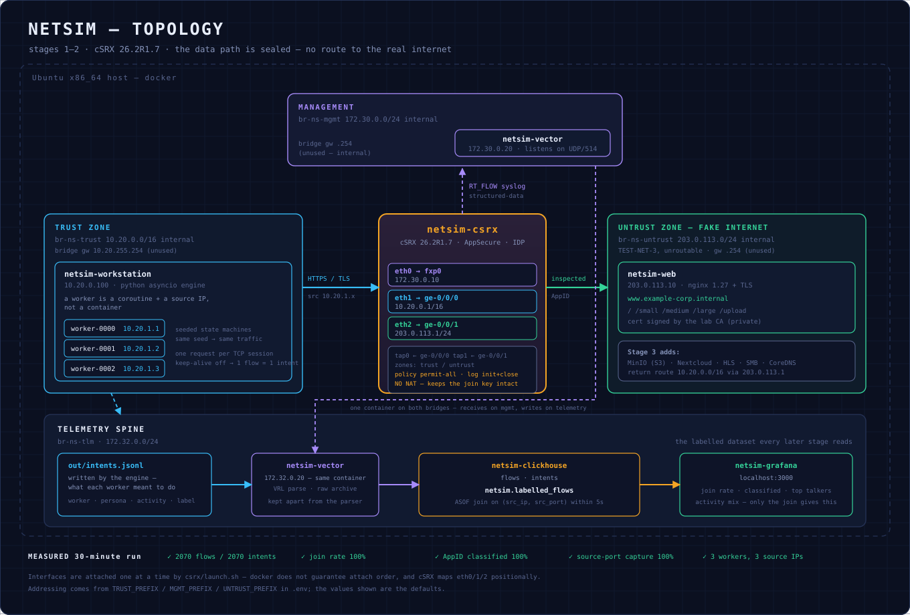

# Stage 1 — Walking Skeleton

Proves the whole path end to end at minimum width:

```
3 workers  ->  br-trust  ->  cSRX 26.2R1  ->  br-untrust  ->  nginx (TLS)
                                 |
                              br-mgmt  ->  syslog sink  ->  out/flows.csv
```

<p align="center">
  
</p>

Nothing here is meant to be realistic. The only question Stage 1 answers is
**can the firewall see individual workers and classify what they are doing** —
because everything in Stages 1–7 assumes it can.

---

## Prerequisites

- x86_64 Ubuntu host (cSRX has no ARM build — see plan §1.1)
- Docker Engine with Compose v2
- The cSRX 26.2R1 image loaded locally
- AppSecure licence installed (without it the `application` field stays `UNKNOWN`)
- Python 3.8+ on the host, for `verify.py`

Load the image and confirm the tag:

```bash
docker load -i <csrx-26.2R1-image>.tgz
docker images | grep csrx
```

---

## Run it

```bash
cp .env.example .env      # set CSRX_IMAGE to match the tag above
make run
```

`make run` chains: generate PKI → build and start → push Junos config → run
traffic for `DURATION_S` → verify.

Or step by step:

```bash
make pki          # lab CA + server cert (once)
make check-order  # prove docker honours interface connect order (~10s)
make up           # networks, syslog sink, cSRX (ordered), web
make config       # push the Junos bootstrap config
make traffic      # run the workers and follow them
make verify       # check the exit criteria
```

`make check-order` is worth running once on a new host. It attaches three
networks to a throwaway alpine container and prints the resulting interface
map. If that does not come out in order, cSRX has no chance either, and you
want to know before debugging a firewall.

---

## Exit criteria

`make verify` must pass all five checks:

| Check | Meaning if it fails |
|---|---|
| Flow events received | Syslog never arrived. cSRX config or mgmt network. |
| session_close events received | Sessions not ageing out, or `then log session-close` missing. |
| ≥3 distinct source IPs | Worker IP allocation or the trust bridge. |
| AppSecure classified traffic | Licence not installed, or AppID not enabled. |
| Join rate ≥98% | Source NAT rewriting ports, clock skew, or keep-alive collapsing sessions. |

Do not start Stage 2 until all five pass. Everything downstream inherits
these problems, and they get much harder to diagnose once there are 25
workers and six services in the picture.

---

## Deliberate design choices

**No source NAT.** The engine records the source port immediately after socket
bind, and cSRX logs the same port. That is the join key between intent and
flow. Introducing NAT means capturing the `nat_*` fields and joining on the
original tuple instead — worth doing eventually, not in Stage 1.

**Keep-alive disabled.** With connection reuse, several requests collapse into
one TCP session, so cSRX logs one flow for many intents and the join silently
under-reports. One request per connection keeps the mapping 1:1. See the note
in `workstation/engine/adapters/https.py`.

**`CSRX_PACKET_DRIVER=interrupt`.** The Juniper default is `poll`, which spins
a CPU core continuously and looks like a runaway process. Switch to `poll` or
`dpdk` only when you actually want throughput numbers.

**A worker is a coroutine plus a source IP, not a container.** This is what
lets the same engine go from 3 workers to hundreds without a rewrite. See
plan §4.1.

**`internal: true` on all three networks.** Guarantees the lab cannot reach the
real internet, and the untrust subnet is TEST-NET-3 (`203.0.113.0/24`), which
is unroutable by design. Two independent safeguards.

**The docker bridge is moved off `.1`.** Docker assigns the first host address
of each subnet to the bridge interface itself. That is the address cSRX needs,
since in a firewall lab the firewall should be the gateway — so each network
sets an explicit `gateway:` at the top of its range (`.255.254` on the /16,
`.254` on the /24s). Without this, starting cSRX fails with
`failed to set up container networking: Address already in use`. The bridge
address is never used: all three networks are `internal`, so it routes nowhere.

**Everything is name-prefixed.** Containers are `netsim-*` and bridges
`br-ns-*` so the lab can coexist with other labs on the same host. Bare names
like `csrx` or `web` collide with anything else already running.

**Addressing lives in `.env` only.** `TRUST_PREFIX`, `MGMT_PREFIX` and
`UNTRUST_PREFIX` feed the compose networks, the Junos interface config (via
placeholders in `bootstrap.set` substituted at apply time), the worker IP
allocator, and the certificate SANs. Moving the lab off a colliding subnet is
a one-line change, and it can run alongside other labs on the same host.

**TX checksum offload is disabled on every endpoint.** Required, not tuning —
cSRX's userspace dataplane loses the `CHECKSUM_PARTIAL` marking, so offloaded
checksums arrive unfinished and get dropped silently. See Troubleshooting. Any
new service in Stage 3 must do the same in its entrypoint.

**Structured-data syslog.** RT_FLOW then emits `key="value"` pairs instead of
the positional format. Stage 2's Vector config depends on this.

---

## Interface ordering — the most likely thing to break

cSRX maps container interfaces **positionally**:

```
eth0 -> fxp0       management   ${MGMT_PREFIX}.10      default 172.30.0.10
eth1 -> ge-0/0/0   trust        ${TRUST_PREFIX}.0.1    default 10.20.0.1
eth2 -> ge-0/0/1   untrust      ${UNTRUST_PREFIX}.1    default 203.0.113.1
```

Get this wrong and you have a firewall wired back-to-front: containers healthy,
logs clean, no traffic. It is the single most expensive failure in Stage 1
because nothing looks broken.

**Docker will not give you this order reliably.** When several networks are
declared at container creation, the attach order is not guaranteed
([moby#25181](https://github.com/moby/moby/issues/25181)), and Compose's
`priority` field does not dependably control it either. This was observed
first-hand here: with `priority` set, `eth0` came up holding the *trust*
address and the management address was absent entirely.

**So cSRX is not a compose service.** `csrx/launch.sh` follows Juniper's
documented procedure instead — start the container attached to the management
network alone, then `docker network connect` the data networks one at a time.
Each connect on a running container adds exactly one interface, in call order.
The script then *verifies* the mapping and refuses to continue if it is wrong,
rather than leaving you to discover it after a traffic run.

Everything else stays in compose; only cSRX needs the special handling.

Check the mapping by hand any time:

```bash
docker exec netsim-csrx ip -o -4 addr show
```

Note that `eth1` and `eth2` showing no address *after cSRX has started* is
normal — within about ten seconds `srxpfe` claims the revenue ports and their
addresses move to `tap0` and `tap1`. Checking `ethN` for an IPv4 address is
therefore racy and will report a false failure.

`launch.sh` verifies by **MAC address** instead: each `ethN`'s MAC is matched
against the docker endpoint it should belong to, which survives the dataplane
takeover. It then separately confirms `tap0` carries the trust address and
`tap1` the untrust address, giving two independent checks of the same mapping.

---

## Telemetry — Stage 2

The Python syslog sink is superseded by a proper spine:

```
cSRX RT_FLOW ──syslog──► Vector ──► ClickHouse ──► Grafana
out/intents.jsonl ──tail─►   │         │
                             │    netsim.labelled_flows   ◄── the join
                             └──► out/syslog_raw.log      (raw archive)
```

| Service | Address | Purpose |
|---|---|---|
| `netsim-vector` | `172.30.0.20` (mgmt), `172.32.0.20` | ingest; takes the sink's old address |
| `netsim-clickhouse` | `172.32.0.10`, host `127.0.0.1:8123` | storage |
| `netsim-grafana` | `172.32.0.30`, host `:3000` | dashboards |

`netsim.labelled_flows` is the artefact everything downstream reads. It uses an
**ASOF join** rather than a range join: ephemeral ports do get reused in a long
run, and a range join would emit one row per candidate intent, inflating every
count. ASOF takes the single nearest preceding intent.

```bash
make runs                                  # per-run health
make sql Q="SELECT * FROM netsim.run_summary FORMAT PrettyCompact"
make dashboard                             # regenerate and reload
```

Grafana is at `http://localhost:3000` (anonymous viewer access is on).

The Stage 1 sink is still available for debugging a VRL change:

```bash
docker compose --profile legacy up -d syslog-sink   # writes out/flows.csv
make verify-csv
```

Parse failures are never dropped silently — they land in
`out/parse_failures.log`, and the raw syslog archive is written independently of
parsing, so a VRL bug cannot lose source data.

---

## Which changes need what

Not everything needs a restart, and the only genuinely destructive command is
`make down`.

| What changed | What to run | Why |
|---|---|---|
| `verify_sql.py` | `make verify` | runs on the host |
| `telemetry/clickhouse/*.sql` | `make down && make up` | init scripts run once, on an empty volume |
| `telemetry/vector/vector.yaml` | `docker compose up -d --force-recreate vector` | config is mounted, not baked |
| `telemetry/grafana/**` | `make dashboard` | provisioning is mounted |
| `Makefile` | nothing | runs on the host |
| `csrx/bootstrap.set` | `make config` | re-push the Junos config |
| `*/entrypoint.sh`, `*/Dockerfile` | `make up` | rebuilds the image |
| `workstation/engine/*.py` | `make up && make traffic` | code is baked into the image |
| a compose *service* | `make up` | compose recreates just that service |
| a compose *network*, or `.env` addressing / `MGMT_EGRESS` | `make down && make up` | docker will not alter an existing network in place |

**`make down` destroys the AppID signature database.** It lives in the cSRX
container filesystem, and `down` removes the container. `make up` reinstalls
automatically if a package is present in `csrx/signatures/`; after an online
download you must repeat `make signatures-online`. Avoid `down` unless you are
actually changing networking.

Picking the lab up after a break or a reboot:

```bash
make status     # what survived, and is the signature database intact
```

A reboot stops containers but does not remove them, so `docker compose start`
plus `docker start netsim-csrx` brings everything back with the signature
database intact.

---

## Troubleshooting

**`pull access denied for csrx`.** The tag in `.env` does not match the image
you loaded. Docker cannot find it locally, assumes it is a registry image, and
tries to pull — there is no cSRX in any public registry, so the error is about
credentials rather than the real cause. Juniper tags include the build number:

```bash
docker images | grep csrx          # e.g. csrx  26.2R1.7
sed -i 's|^CSRX_IMAGE=.*|CSRX_IMAGE=csrx:26.2R1.7|' .env
```

**`Pool overlaps with other one on this address space`.** A subnet here
collides with an existing docker network or host route. Find the culprit:

```bash
docker network ls -q | xargs -n1 docker network inspect \
  --format '{{.Name}} {{range .IPAM.Config}}{{.Subnet}}{{end}}'
ip -br route
```

If it is a stale network, `docker network prune`. If it belongs to something
you need, move this lab instead — the three prefixes in `.env` are the only
place addressing is defined:

```bash
TRUST_PREFIX=10.30            # expands to 10.30.0.0/16
MGMT_PREFIX=172.31.0          # expands to 172.31.0.0/24
UNTRUST_PREFIX=198.51.100     # expands to 198.51.100.0/24
```

Regenerate the PKI after moving — the server certificate carries the untrust
address as an IP SAN, so a stale cert fails TLS:

```bash
rm -f pki/*.crt pki/*.key pki/*.srl && make pki && make down && make run
```

**`Address already in use` when cSRX starts.** A container address collides
with the docker bridge's own gateway. Check what the bridge holds:

```bash
docker network inspect netsim-stage1_trust \
  --format '{{range .IPAM.Config}}subnet={{.Subnet}} gateway={{.Gateway}}{{end}}'
```

The gateway must not equal any `ipv4_address` in `docker-compose.yml`.

**Connections time out with no response, but everything checks out.** This is
the signature failure of this lab, and it looks like nothing is wrong:

- cSRX pings both neighbours fine
- interfaces, zones and policy all committed correctly
- sessions ARE created and permitted (`show security flow session`)
- but `In:` shows packets and `Out:` shows zero
- `tcpdump` on the destination shows the SYN arriving
- the destination is listening on the port
- no RST, no log entry, nothing

The cause is **TX checksum offload**. The sending kernel does not compute the
TCP checksum — it writes a pseudo-header value and marks the buffer
`CHECKSUM_PARTIAL` for hardware to finish. That metadata survives veth and
bridges, which is why ordinary container-to-container traffic works and
`tcpdump` routinely reports "incorrect" checksums on healthy hosts.

It does **not** survive cSRX's dataplane, which reads raw frames in userspace
and re-emits them. What arrives carries an unfinished checksum with no metadata
saying so, and the receiving kernel drops it silently — before the socket, and
after tcpdump has already captured it.

Confirm it in a capture:

```bash
docker run --rm --net container:netsim-web nicolaka/netshoot \
  tcpdump -i eth0 -n -e -vv -c 6 'tcp port 443'
```

`cksum 0x474e (incorrect -> 0xe9ef)` where the *first* value repeats across
retransmits while the second changes is the fingerprint: an unfinished
checksum, not corruption.

The fix is applied automatically in both entrypoints:

```bash
ethtool -K eth0 tx off
```

Both endpoints need it — the workstation for requests, the web server for
replies, since the return path crosses the same dataplane. Any service added in
Stage 3 needs it too.

**`application` is UNKNOWN on every session.** cSRX ships with no signature
database — check slot 1:

```bash
docker exec netsim-csrx cli -c 'show services application-identification status'
```

`Application package version 0` / `Status Free` means AppID is running but has
nothing to match against. That is correct behaviour, not a fault. Two fixes:

*Offline (keeps the lab airgapped):* download the package from Juniper, then

```bash
cp <package>.tgz csrx/signatures/ && make signatures
```

*Online:* give the management bridge egress. Trust and untrust stay internal,
so the simulated data plane still cannot reach the real internet:

```bash
sed -i 's/^MGMT_INTERNAL=.*/MGMT_INTERNAL=false/' .env
make down && make up          # the network must be recreated
make signatures-online
```

Either way the database lives in the container filesystem, so `make down`
destroys it. `make up` reinstalls automatically when a package is present in
`csrx/signatures/`; after an online download you must repeat it.

**No flows at all.** Check syslog is leaving cSRX:

```bash
docker exec -it netsim-csrx cli -c 'show configuration system syslog'
docker logs netsim-syslog-sink
```

**Workers cannot reach the web server.** The workstation entrypoint runs a
curl check at startup — read `docker logs netsim-workstation`. Then confirm the
firewall is passing:

```bash
docker exec -it netsim-csrx cli -c 'show security flow session'
docker exec -it netsim-csrx cli -c 'show security policies detail'
```

**`application` is UNKNOWN.** Confirm the licence and that AppID is running:

```bash
docker exec -it netsim-csrx cli -c 'show system license'
docker exec -it netsim-csrx cli -c 'show services application-identification status'
```

**Join rate below 98%.** `verify.py` distinguishes the two causes: matched-on-
port-but-outside-the-window means clock skew, no port match at all means NAT
or keep-alive.

---

## Layout

```
lab/
├── docker-compose.yml       networks and the non-cSRX services
├── Makefile                 pki / up / config / traffic / verify
├── .env.example
├── verify.py                exit-criteria check
├── csrx/
│   ├── bootstrap.set        Junos config (zones, AppID, syslog, policy)
│   ├── launch.sh            ordered launch + interface-mapping verification
│   └── apply-config.sh      pushes config after the container is healthy
├── internet/                nginx + TLS, the fake internet
├── pki/make-ca.sh           lab CA and server certificate
├── telemetry/syslog_sink.py RT_FLOW -> flows.csv
├── workstation/
│   ├── entrypoint.sh        per-worker IPs, default route via cSRX
│   └── engine/
│       ├── __main__.py      orchestrator
│       ├── worker.py        seeded state machine
│       ├── ipalloc.py       deterministic worker -> IP
│       ├── intent.py        ground-truth log
│       └── adapters/https.py
└── out/                     flows.csv, intents.jsonl, syslog_raw.log
```

---

## What Stage 2 adds

Vector replacing the Python sink, ClickHouse replacing the CSV, the
`labelled_flows` view, and Grafana. The CSV columns here already match the
`flows` table in plan §5.1, and `intents.jsonl` already matches `intents` in
§5.2 — so Stage 2 is a transport change, not a schema change.
